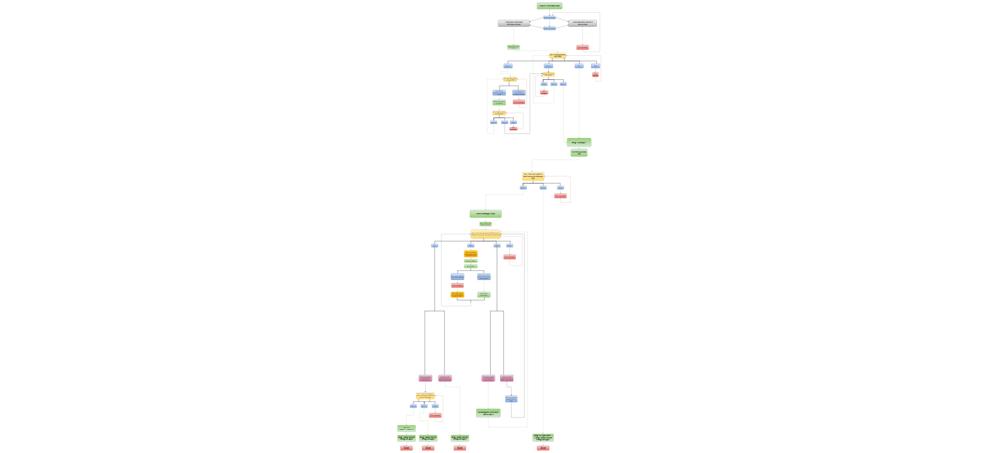

<h1 align="center">🔐Passwords Generator & Manager - Applications🔐</h1>
“Passwords Generator and Manager” starts with an application that helps you generate strong and secure passwords for your online accounts. With the password generator application, you can create unique passwords that are difficult to guess or hack. This application also leads you to a password manager application (Section) that helps you manage your passwords by storing them securely in an encrypted file. You can easily access your passwords whenever you need them, without having to remember them all.  

The Passwords Generator and Manager is live and deployed on Heroku cloud platform, please click [HERE](https://password-generator-and-manager-a88bcb86c5e0.herokuapp.com/) to check it out.

## Table of Contents
+ [UX](#ux "UX")
  + [App Purpose](#App-purpose "App Purpose")
  + [App Goal](#App-goal "App Goal")
  + [Audience](#audience "Audience")
  + [Communication](#communication "Communication")
  + [Current User Goals](#current-user-goals "Current User Goals")
  + [New User Goals](#new-user-goals "New User Goals")
+ [Design](#design "Design")
+ [Features](#features "Features")
  + [Existing Features](#existing-features "Existing Features")
+ [Testing](#testing "Testing")
  + [Validator Testing](#validator-testing "Validator Testing")
  + [Unfixed Bugs](#unfixed-bugs "Unfixed Bugs")
+ [Technologies Used](#technologies-used "Technologies Used")
  + [Main Languages Used](#main-languages-used "Main Languages Used")
  + [Frameworks, Libraries & Programs Used](#frameworks-libraries-programs-used "Frameworks, Libraries & Programs Used")
+ [Deployment](#deployment "Deployment")
+ [Credits](#credits "Credits")
  + [Content](#content "Content")
  + [Media](#media "Media")

## UX

### App Purpose:
“Passwords Generator and Manager” is an application that helps you generate strong and secure passwords for your online accounts. With this application, you can create unique passwords that are difficult to guess or hack. The application also leads you to a password manager application that allows you to store your passwords securely in an encrypted file. You can easily access your passwords whenever you need them, without having to remember them all. This application is designed to make your online life easier and more secure.

### App Goal: 
- Generate strong and unique passwords that are difficult to guess or hack.
- Store your passwords & its username securely in an encrypted file, so you don’t have to remember them all.

### Audience:
Everyone who wants unique passwords that are difficult to guess or hack for their accounts and also who have multiple online accounts and have trouble remembering all their passwords and want to store them in secure place.

### Communication:
The App expresses its intent through the print statements generated, prompting the user to walk through the options available & make their selections. Various statements also print in a variety of colour to help break up the monotony of the white text, making it easier to read.

### Current User Goals:
- Generate strong and unique passwords for their online accounts.
- Store their passwords and usernames securely in an encrypted file.
- Easily to back to their saved passwords whenever they need them.

### New User Goals:
- Generate fast small passwords that are easy to remember but still secure.
- Share their passwords and usernames with trusted family members or friends.

### Future Goals:
Same features in my version of "Norton" Passwords Generator and Manager:
- Create an account for each user that shows only their passwords and requires a master password and username to access
- Provide a password strength meter that shows the strength of each password generated.
- Provide a feature that allows users to import and export their passwords to other applications.
- Password expiration reminders, two-factor authentication.
- Biometric authentication technologies such as facial recognition or fingerprint scanning.
- Encrypt the data with public key and decrypt these data with different privet key (asymmetric encryption)

## Design

### [Diagrams-App](https://app.diagrams.net/)
This flowchart was created to visualise the logical flow and various paths possible.                          
You can view the Application diagram and see each process in detail by clicking [HERE](https://alakeldev.github.io/pp3-diagram/).  

