<h1 align="center">🔐Passwords Generator & Manager🔐</h1>
“Passwords Generator and Manager” it starts with an application that helps you to generate strong and secure passwords for your online accounts. With the password generator application, you can create unique passwords that are difficult to guess or hack. This application also leads you to a password manager application that helps you to manage your passwords by storing them securely in an encrypted file. You can easily access your passwords whenever you need them, without having to remember them all.  

The Passwords Generator and Manager application is live and deployed on the Heroku cloud platform: 
- Please click [HERE](https://password-generator-and-manager-a88bcb86c5e0.herokuapp.com/) to check it out.

## Table of Contents
- [Table of Contents](#table-of-contents)
- [UX](#ux)
  - [App Purpose](#app-purpose)
  - [App Goals](#app-goals)
  - [Audience](#audience)
  - [Communication](#communication)
  - [Current User Goals](#current-user-goals)
  - [New User Goals](#new-user-goals)
  - [Future Goals](#future-goals)
- [Logic](#logic)
  - [Diagrams-App](#diagrams-app)
- [Design](#design)
  - [Colour](#colour)
  - [Existing Features](#existing-features)
  - [Hidden Features](#hidden-features)
  - [Future Features](#future-features)
- [Testing](#testing)
  - [Validator Testing](#validator-testing)
  - [Fixed Bugs](#fixed-bugs)
  - [Unfixed Bugs](#unfixed-bugs)
- [Technologies Used](#technologies-used)
  - [Main Languages Used](#main-languages-used)
  - [Python Packages-Modules](#python-packages-modules)
  - [Tools](#tools)
- [Deployment](#deployment)
  - [How to deploy](#how-to-deploy)
  - [How to clone](#how-to-clone)

## UX

### App Purpose
It is an application that helps you generate strong and secure passwords for your online accounts. With this application, you can create unique passwords that are difficult to guess or hack. The application also leads you to a password manager application that allows you to store your passwords securely in an encrypted file. You can easily access your passwords whenever you need them, without having to remember them all. This application is designed to make your online life easier and more secure.

### App Goals
- Generate strong and unique passwords that are difficult to guess or hack.
- Store the user passwords & usernames securely in an encrypted file, so you don’t have to remember them all.

### Audience
Everyone who wants unique passwords that are difficult to guess or hack for their accounts and also who have multiple online accounts and have trouble remembering all their passwords and want to store them in secure place.

### Communication
The App expresses its intent through the print statements generated, prompting the users to walk through the options available & make their selections. Various statements also are printed in a variety of colour to help break up the monotony of the white text with the aim of making each one of these statements more easy to read.

### Current User Goals
- Generate strong and unique passwords for their online accounts.
- Store their passwords and usernames securely in an encrypted file.
- Easily go back to their saved passwords whenever they need them.

### New User Goals
- Generate fast small-medium passwords that are easy to remember but still secure.
- Generate fast long passwords that are really secure and hard to guess.
- Share their passwords and usernames with trusted family members or friends.

### Future Goals
Most of the following features are in the version of "Norton" Passwords Generator and Manager:
- Provide a password strength indicator that shows the strength of each password generated.
- Provide a feature that allows users to import and export their passwords to other applications.
- Biometric authentication technologies such as facial recognition or fingerprint scanning.
- Encrypt the data with public key and decrypt these data with different privet key (asymmetric encryption).
- Remove the file of my-passwords.txt file and save the user passwords in encrypted version directly.
- Make the encryption and decryption through APIs.

## Logic

### [Diagrams-App](https://app.diagrams.net/)
The following flowchart was created to visualise the logical flow and various paths possible.                          
You can view the Application diagram-flowchart and see each path in detail by clicking [HERE](https://alakeldev.github.io/pwds-app-diagram/).  

## Design

### Colour
- The Python “termcolor” module was used to add color to the project. The colors white, green, yellow and red were employed to represent different paths and results. White was used for the normal questions, messages and answer guides (such as “yes”/“no” or “save”/“view”). Green was used for the application (Generator & Manager) titles, welcome and bye messages, and important results such as the newly generated password. Red was used for errors, abnormal messages and the ‘Exit’ path guide. Yellow was used to indicate special questions or guide messages.
- The app titles were created with ASCII art using the Python “pyfiglet” module. The green color and ASCII art enhanced the design of the titles.

### Existing Features
- Landing Page + Passwords Generator App Start:

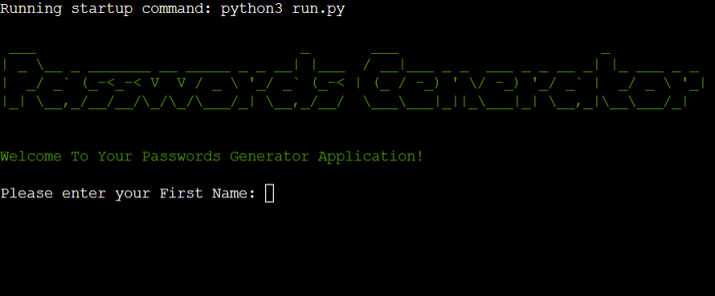

- Get Full-Name + Welcome Message:

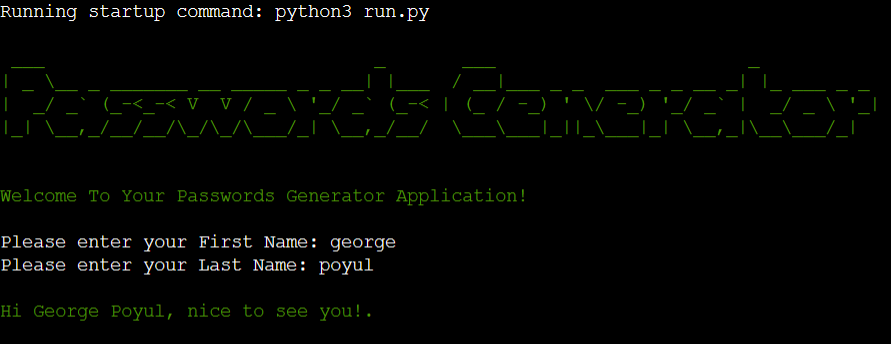

- Passwords Generator Run Full-Path:

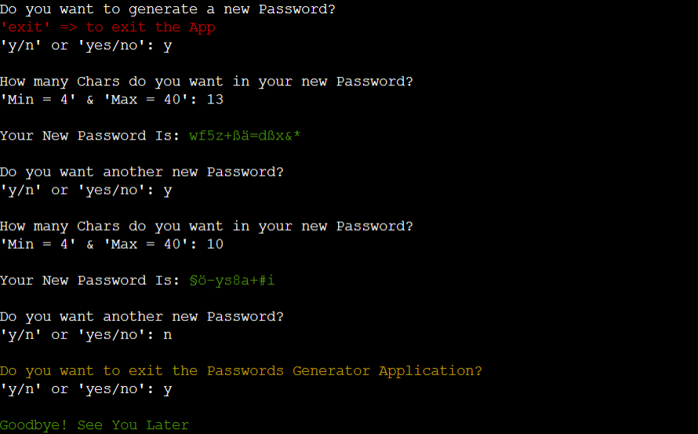

- Passwords Generator Run "Exit" Path:

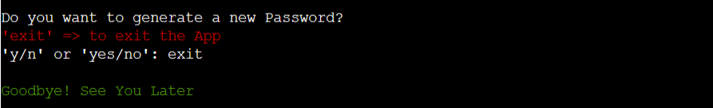

- Passwords Manager App Start + Welcome Message:

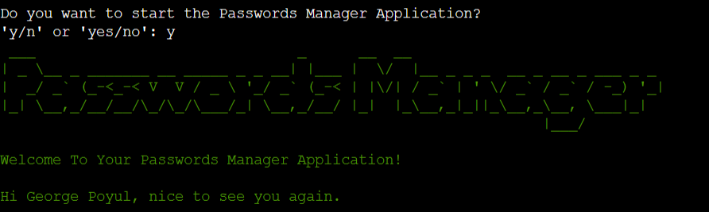

- Passwords Manager App - "Save" Path:

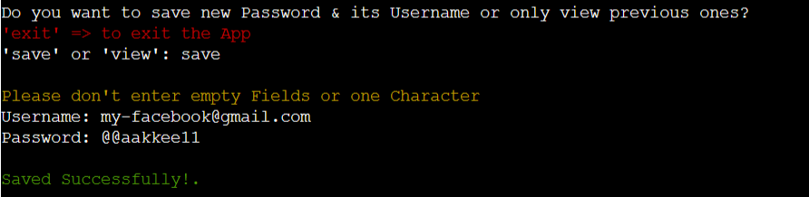

- Passwords Manager App - "View" Path => There are saved previous Passwords:

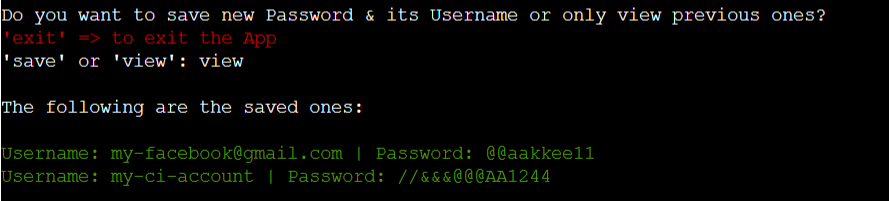

- Passwords Manager App - "View" Path => No previous Saved Passwords:

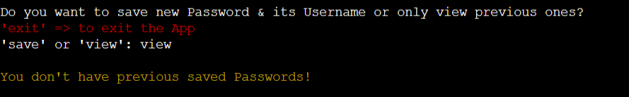

- Passwords Manager App - "Exit" Path => Yes Ask: There are saved previous Passwords:

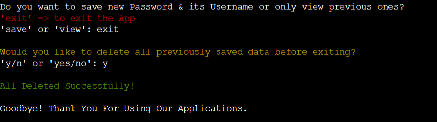

- Passwords Manager App - "Exit" Path => No Ask: No Previous Saved Passwords:

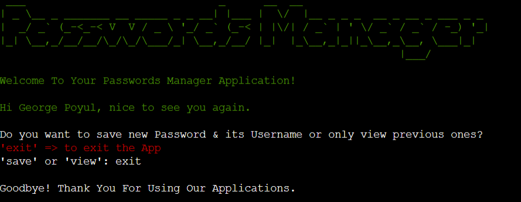

- Passwords Generator + Manager Apps => The Shortest "Exit" Path:

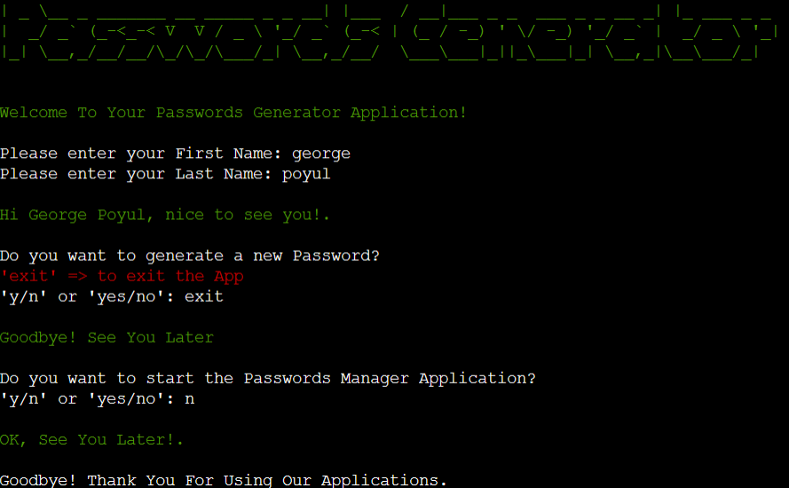

### Hidden Features
- Passwords Manager App Start: 
When the user answer ‘yes’ to the question: ‘Do you want to start the Passwords Manager Application for the first time?’, a new file named ‘the-security-key.key’ will be created, and a symmetric key will be generated and stored inside that file.

- Passwords Manager App - "Save" Path: 
When the user chooses the 'save' path and enters a username and password fields (without leaving any fields empty or with only one character), these entries will be saved inside ‘my-passwords.txt’. Then, a function will run to retrieve the data from ‘my-passwords.txt’ and will encrypt the retrieved data with the symmetric key that was stored inside ‘the-security-key.key’. The encrypted data will then be stored inside a new file named ‘my-encrypted-data.txt’.

- Passwords Manager App - "View" Path: 
When the user chooses the 'view' path and there are previously saved passwords inside ‘my-passwords.txt’, a function will run to retrieve the data from this file and will encrypt the retrieved data with the symmetric key that is stored inside ‘the-security-key.key’. The encrypted data will then be stored inside a new file named ‘my-encrypted-data.txt’. Then, another function will run to decrypt the data from ‘my-encrypted-data.txt’ file with the same key and print it out on the terminal.

- Passwords Manager App - "Exit" Path: 
When the user chooses to exit the Passwords Manager Application and there is previously saved data, a function will run and ask if they want to remove the previously saved data. If the user enters ‘yes’, a new function will run that will delete all of the data inside the files ‘my-passwords.txt’ and ‘my-encrypted-data.txt’.

### Future Features
- Create an account for each user that shows only their passwords and requires a master password and username to access.
- Remove and edit a specific saved username or password inside the file without affecting any other saved data.
- Password expiration reminders, two-factor authentication.
- Create a simple and beautiful GUI for the application.

## Testing
- Extensive testing was completed to review each possible path/scenario a user might take. This was to ensure looping back to the specific and related point, error messages that can be understood by the user were shown to them and finally no dead ends were encountered.
- Check the project flowchart to get each path detail by clicking [HERE](https://alakeldev.github.io/pp3-diagram/).

### Validator Testing
- The code has been tested by using [PEP8-CI Heroku-App](https://pep8ci.herokuapp.com/): 
As shown in the photo below, there is an error on line 127 that says “invalid escape sequence ‘\d’”. After conducting extensive searches and consulting with CI tutor support, I was unable to avoid this error as it is related to a “Regular Expression”.

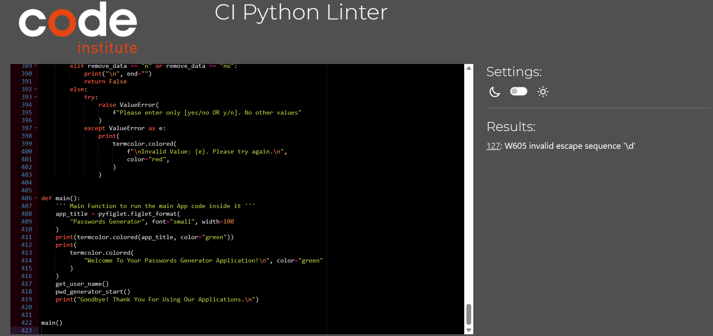

### Fixed Bugs
- The photo below shows a bug that I encountered on the Heroku terminal. After conducting extensive research and reading about it, I found that the best solution was to import the Python module ‘codecs’.

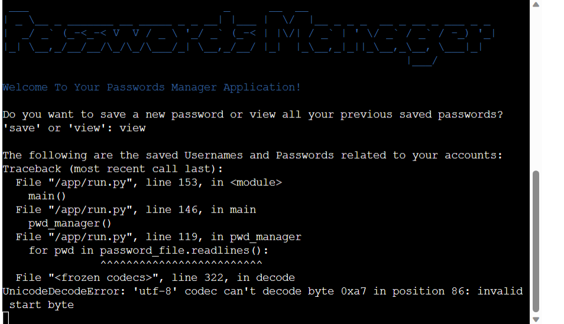

- The following two photos show a bug at two different times. Because of that, I have done more searches on Google and read more about Fernet and cryptography to find the issue with my code and learn more about encryption and decryption methods with a symmetric key.

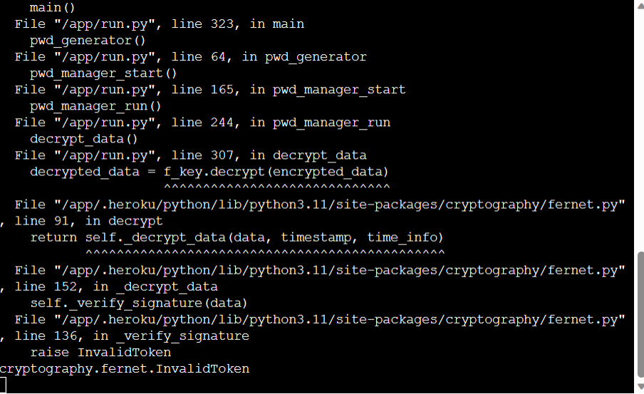

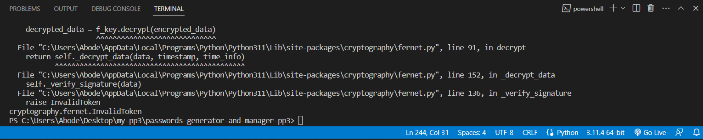

- Although I encountered some error messages, I was able to resolve them by adding if statements in certain situations. This approach provided the best logic, as well as an easy and fast solution.

### Unfixed Bugs
- None currently found.

## Technologies Used
### Main Languages Used 
- [Python](https://www.python.org/)

### Python Packages-Modules
- [termcolor](https://pypi.org/project/termcolor/): print colored text in the terminal.
- [pyfiglet](https://pypi.org/project/pyfiglet/): create the app titles with ASCII art.
- [random](https://docs.python.org/3/library/random.html): the primary objective is to generate a new password each time the user requests one by selecting random characters from the constant ‘PWD_CHARACTERS’.
- [re](https://docs.python.org/3/library/re.html): the primary use of regular expressions and matching operations is to extract the first and last name of the user. Additionally, these operations are used to limit the input with numbers only in addition to condition which will limit also the number of characters to be between 4 to 40.
- [codecs](https://docs.python.org/3/library/codecs.html): provides a way to encode and decode data.
- [os](https://docs.python.org/3/library/os.html): the primary use of file manipulation is to create, read, and write files. Additionally, it is used to manipulate paths such as those used in if conditions to check the file, and to check the file size.
- [Fernet](https://cryptography.io/en/latest/fernet/): the cryptography package includes a feature "Fernet" that allows for the encryption and decryption of data within a file using a symmetric key.

### Tools
- [Heroku](https://id.heroku.com) was used to deploy the live project.
- [PEP8-CI](https://pep8ci.herokuapp.com/) online was used to validate Python code.
- [Diagrams.net](https://app.diagrams.net/) was used to create the Flowchart.
- [GitHub](https://github.com/) GitHub is used to store the projects code after being pushed from Git.
- [VS-code](https://code.visualstudio.com/) - IDE to write Python code, create new files and folders for the project.

## Deployment
- The application was deployed successfully on the Heroku Cloud Platform.
- I used VS Code IDE to write the Python code, and it was easy to use its terminal to commit my files and push them to my repository on GitHub.
- It’s very important to install all necessary Python modules/packages and import them into your project. Open the VS Code terminal and write: “pip freeze > requirements.txt” then commit and push this change to your GitHub repo before starting the deployment process on Heroku.

### How to deploy 
- The deployment on Heroku was done through the following steps:
  - log in to Heroku.
  - Create a new app in Heroku.
  - Select "New" and "Create new app".
  - Name the new app & Choose a region then click "Create app".
  - Click on the "Settings" tab at the top of the page.
  - Open the "Reveal Config Vars" section and input the following information:
    - KEY: PORT, VALUE: 8000.
  - Go to buildpacks section and press on add buildpack.
  - Select Python and Nodejs, Make sure they are in this order.
  - Click on the "Deploy" tab at the top of the page.
  - In "Deployment Method" click on "GitHub" to connect them.
  - Select "connect" to the target Repo on Github.
  - Enable Automatic Deploys" or "Deploy Branch".
  - Heroku will start the process to deploy your App.

### How to clone
- Go to the following repository on GitHub: https://github.com/alakeldev/passwords-generator-and-manager-pp3
- At the top right of the screen, click the 'Code' button, and then click 'HTTPs'.
- Copy the link in this field.
- Open VS-code, creat new project folder, open the terminal.
- On the terminal type "git clone", then paste the copied url and press 'Enter'.
- The clone process should now begin.

